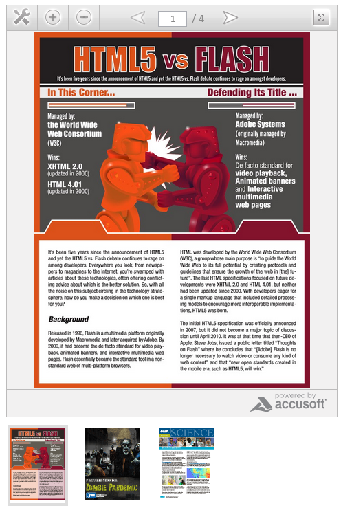

### Prizm Cloud Document Viewer jQuery Plugin

jQuery plugin allows you to display the Prizm Cloud Document Viewer with clickable thumbnails which update the base viewer with the new document dynamically. Multiple viewers can be on the same page. Prizm Cloud is a cloud based document viewer, so you can display over three hundred different file types on your website, while the documents stay on your server without additional installation of software or hardware.



###Prerequisites

Your **html** should have the following

* An outer wrapper element with a unique id
	```
	<div id="prizmcloud-container">...</div>
	```
* Within the outer wrapper, a wrapper for the thumbnails
	```
	<div class="documents-for-switching" id="documents-for-switching">...</div>
	```
* Within the outer wrapper, a wrapper for the Document Viewer
	```
	<div class="prizmcloud-viewer" id="prizmcloud-viewer">...</div>
	```

###Javascript Options

* **type**: is the viewer type (either flash or html5)
* **doc_url**: is the document url
* **vwidth**: is the viewer width in px (int)
* **vheight**: is the viewer height in px (int)
* **print_button**: options 'Yes' or 'No'
* **toolbar_color**: hex color, no '#' for example "CCCCCC"
* **cache**: 'Yes' or 'No'


##jQuery

The js file is jquery.prizmcloud.js. Add this script to the header or footer of your page.

* Requires jQuery 1.7.2 or greater

```
<script src="jquery.js"></script>
<script src="jquery.prizmcloud.js"></script>
```

###The HTML

The html needs the following

* the wrappers as described above
* the thumbnails need to be an element with:
	* a class **'doc-link'** and 
	* a data type of 'doc-link' or a href which contains document url. 

For example:

```
<div class="doc-link" data-doc-link="http://www.accusoft.com/docs/prizm-cloud-flash-vs-html5.pdf" ></div>
or
<a data-doc-link="http://www.accusoft.com/docs/prizm-cloud-flash-vs-html5.pdf" class="doc-link"></a>
or
<a href="http://www.accusoft.com/docs/prizm-cloud-flash-vs-html5.pdf" class="doc-link"></a>
```

Complete html example:

```
<div id="prizmcloud-container">
    <div class="prizmcloud-viewer" id="prizmcloud-viewer">
        <iframe id="pc_viewer_box" width="460" height="650" frameborder="0" src="http://connect.ajaxdocumentviewer.com/?key=03232898832&viewertype=html5&document=http://www.accusoft.com/docs/prizm-cloud-flash-vs-html5.pdf&viewerheight=600&viewerwidth=440&printButton=Yes&toolbarColor=CCCCCC&cache=yes" seamless></iframe>
    </div>
    <div class="documents-for-switching" id="documents-for-switching"> 
        <a href="http://www.accusoft.com/docs/prizm-cloud-flash-vs-html5.pdf" data-doc-link="http://www.accusoft.com/docs/prizm-cloud-flash-vs-html5.pdf" class="doc-link active">
			</a>
		<a href="http://www.cdc.gov/phpr/documents/11_225700_A_Zombie_Final.pdf" data-doc-link="http://www.cdc.gov/phpr/documents/11_225700_A_Zombie_Final.pdf" class="doc-link">
			</a>
    </div>
</div>
```

###To initialize your viewer

You can add this code, for example, to a js file and include after the prizmcloud.js or part of a jQuery document ready event or both.

```
$('selector').prizmcloud();
```
In jQuery document ready event
```
jQuery(document).ready(function($) {
    $('#prizmcloud-container').prizmcloud({
        vheight: 400,
        vwidth: 400,
        type: 'flash',
        print_button: 'No'
    });
});
```